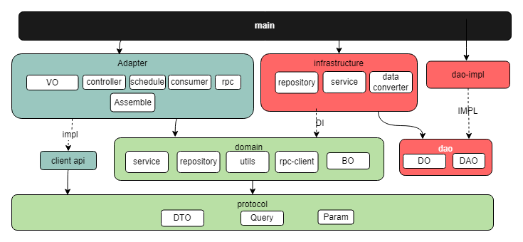

# sparrow-coder 麻雀代码生成器 【灵活半自动化代码生成器】

# 核心功能
## 基于整洁架构生成核心代码


[sparrow-example](https://github.com/sparrowzoo/sparrow-example)

## 生成前后端代码
- 支持前后端分离和不分离版本
- 本示例为不分离版本，分离版本由网友自行配置

# 使用方式
## 添加sparrow 依赖
个性maven settings 配置文件

```
{user.home}/.m2/setting.xml
<?xml version="1.0" encoding="UTF-8"?>
<settings xmlns="http://maven.apache.org/SETTINGS/1.0.0"
          xmlns:xsi="http://www.w3.org/2001/XMLSchema-instance"
          xsi:schemaLocation="http://maven.apache.org/SETTINGS/1.0.0 http://maven.apache.org/xsd/settings-1.0.0.xsd">

    <localRepository>${user.home}/.m2/repository</localRepository>
    <interactiveMode>true</interactiveMode>
    <profiles>
        <profile>
            <id>center-repository</id>
            <repositories>
                <repository>
                    <id>center</id>
                    <name>center Repository</name>
                    <url>https://s01.oss.sonatype.org/content/repositories/snapshots</url>
                    <snapshots>
                        <enabled>true</enabled>
                        <updatePolicy>always</updatePolicy>
                        <checksumPolicy>warn</checksumPolicy>
                    </snapshots>
                    <releases>
                        <enabled>true</enabled>
                    </releases>
                </repository>
            </repositories>
        </profile>
    </profiles>

    <activeProfiles>
        <activeProfile>center-repository</activeProfile>
    </activeProfiles>
</settings>
```

## 环境变量配置说明
参考EnvConfig 代码说明
```
com.sparrow.coding.config.EnvConfig
```

## java 类生成

```
cd /sparrow-coder/example-po/src/bin //切到bin 目录
sh sparrow-java-coder.sh --help //帮助菜单
sh sparrow-java-coder.sh --example //生成示例代码

sh sparrow-java-coder.sh -ct com.sparrow.example.po.SparrowExample
```

## 前端代码生成


```
sh sparrow-front-coder.sh --help //帮助菜单
sh sparrow-front-coder.sh --example //生成示例代码

生成对应页面脚本示例
sh sparrow-front-coder.sh -mp com.sparrow.coding.config.ExampleFront
sh sparrow-front-coder.sh -cp com.sparrow.coding.config.ExampleFront
sh sparrow-front-coder.sh -cj com.sparrow.coding.config.ExampleFront
sh sparrow-front-coder.sh -lj com.sparrow.coding.config.ExampleFront
sh sparrow-front-coder.sh -mj com.sparrow.coding.config.ExampleFront

```


